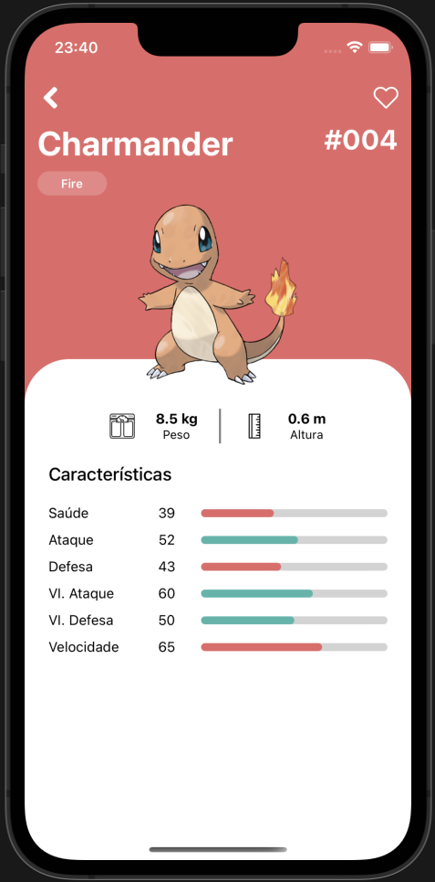

# Pokedex

Tela Inicial            |  Tela de detalhe
:-------------------------:|:-------------------------:
  |  

### :rocket: Como exutar:

Para executar o projeto é necessário ter o [Node.js](https://nodejs.org/en/) e o [Yarn](https://classic.yarnpkg.com/lang/en/docs/install/#windows-stable) instalados.

Primeiro, instale as dependências do projeto:

```
yarn install
```

E para executar a pokedex no android:

```
react-native run-android
```
Para executar a pokedex no iOS:

```
react-native run-ios
```

## :test_tube: Testes:

Para rodar os testes, basta executar o comando:

```
yarn test
```

## Dados:

 - [PokeAPI](https://pokeapi.co/)


